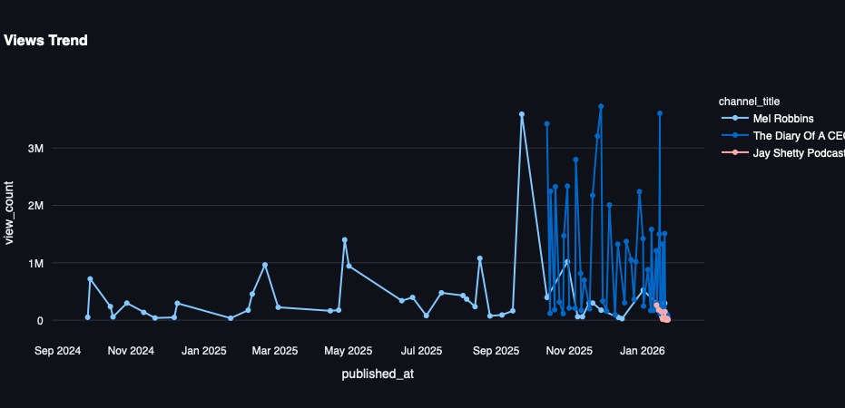
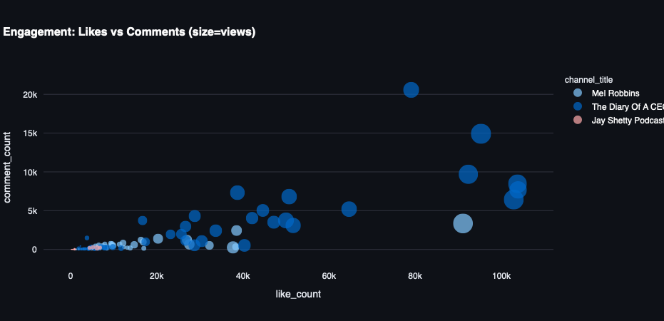

# 🎥 YouTube Data Pipeline 🚀

  

An end-to-end **YouTube data pipeline** that extracts, transforms, and loads video data from multiple channels using the **YouTube API**, storing it in PostgreSQL, and visualizing insights via a **Streamlit dashboard**. This project demonstrates a full data engineering workflow with caching, logging, and containerized deployment.

---

## 📊 Dashboard Screenshots

### Views Trend


### Engagement Overview


---

## Features

- **🎬 API-powered ETL:** Fetches videos and channel statistics from multiple YouTube handles.
- **🧹 Data transformation:** Cleans and merges raw video and statistics data into a structured format.
- **💾 Database loading:** Automatically loads transformed data into PostgreSQL for analytics.
- **📊 Interactive dashboard:** Streamlit dashboard to explore channel metrics, video performance, and engagement trends.
- **🐳 Containerized deployment:** Fully dockerized ETL and dashboard services for reproducible end-to-end execution.
- **⚡ Caching & logging:** Efficient data loading with caching, and logs for ETL tracking and debugging.

---

## Tech Stack

- Python 3.12  
- Streamlit, Pandas, Plotly, Psycopg2  
- PostgreSQL 15  
- Docker & Docker Compose  
- YouTube API v3  

---

## Installation & Setup

1. **Clone the repository**

```bash
git clone https://github.com/Smartlyfe21/youtube-data-pipeline.git
cd youtube-data-pipeline


Set up environment variables
Create a .env file in the root directory with the following:
YOUTUBE_API_KEY=<YOUR_YOUTUBE_API_KEY>
DB_HOST=localhost
DB_PORT=5432
DB_NAME=youtube_db
DB_USER=postgres
DB_PASSWORD=postgres
API_TIMEOUT=10
LOG_LEVEL=INFO
VIDEO_TABLE=youtube_videos
TEST_MODE=False

Install Python dependencies (if running locally)
python -m venv .venv
source .venv/bin/activate
pip install -r requirements.txt

Run Docker containers
docker compose up -d
ETL Service: Automatically fetches, transforms, and loads YouTube data.
Streamlit Dashboard: Accessible at http://localhost:8501

Other commands:
# View ETL container logs
docker logs -f youtube_etl

# Run the ETL manually
python src/run_etl.py

# Start the dashboard manually
streamlit run src/YouTube_dashboard.py --server.port=8501

ETL Workflow
Extract: Retrieves videos and statistics from pre-defined YouTube channels using the YouTube API. Handles empty results gracefully.
Transform: Cleans, merges, and structures the data into a unified DataFrame suitable for database storage.
Load: Inserts the transformed data into a PostgreSQL table (youtube_videos) for querying and visualization.
Dashboard Features
Metrics Overview: Total videos, views, likes, and comments.
Time-Series Analysis: Video views trends over time per channel.
Engagement Scatter: Likes vs Comments with view count sizing.
Latest Videos: Playable videos with thumbnails and key metrics.
Contributing
Feel free to submit issues or pull requests!
Suggestions: Add more channels, caching strategies, or advanced analytics.
License
MIT License
